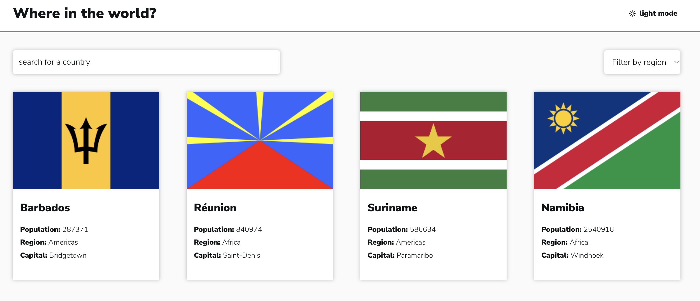

# Frontend Mentor - REST Countries API with color theme switcher solution

This is a solution to the [REST Countries API with color theme switcher challenge on Frontend Mentor](https://www.frontendmentor.io/challenges/rest-countries-api-with-color-theme-switcher-5cacc469fec04111f7b848ca).

## Table of contents

- [Overview](#overview)
  - [The challenge](#the-challenge)
  - [Screenshot](#screenshot)
  - [Links](#links)
- [My process](#my-process)
  - [Built with](#built-with)
  - [What I learned](#what-i-learned)
  - [Continued development](#continued-development)

## Overview

### The challenge

- See all countries from the API on the homepage
- Search for a country using an `input` field
- Filter countries by region
- Click on a country to see more detailed information on a separate page
- Click through to the border countries on the detail page
- Toggle the color scheme between light and dark mode

### Screenshot

Overview with search & filter function of all countries:

Detailed country view in dark mode:

Detailed country view in light mode:

### Links

- Live Site URL: [Check out the project](https://fastidious-pothos-a56338.netlify.app/)

## My process

### Built with

- Semantic HTML5 markup
- SASS & CSS modules
- React

### What I learned

- Implement dark mode with context API from react
- Using Sass functions to apply dark or light mode styles automatically
- Refreshen my memory of react router to create dynamic routes with react router

### Continued development

Use this section to outline areas that you want to continue focusing on in future projects. These could be concepts you're still not completely comfortable with or techniques you found useful that you want to refine and perfect.
